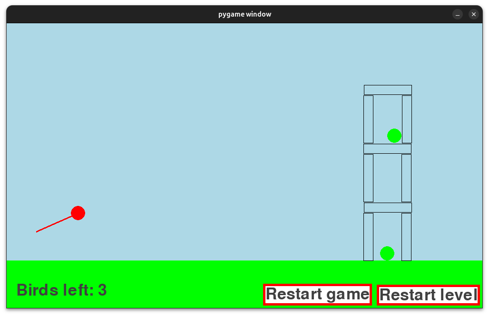
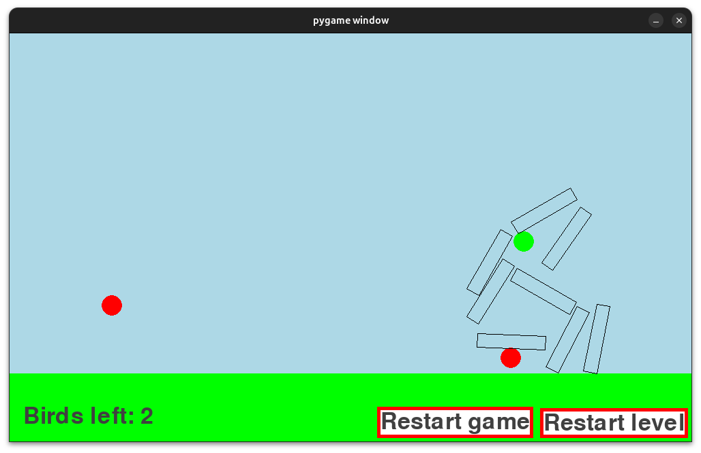

# Simple Angry Birds clone

A minimal physics-based Angry Birds–style clone built with Pygame (for rendering) and Pymunk (for 2D physics).

## Requirements
- Python(3.11+ recommended)
- Pygame
- Pymunk

## Instruction
```bash
# Clone the repo
git clone https://github.com/m-dobrowolski/angry-birds-clone.git
```
```bash
# Create a virtual environment and install dependencies
python3 -m venv venv

source venv/bin/activate   # On Linux/Mac
venv\Scripts\activate      # On Windows

pip install -r requirements.txt
```
```bash
# Run the game
python main.py
```

## Preview

